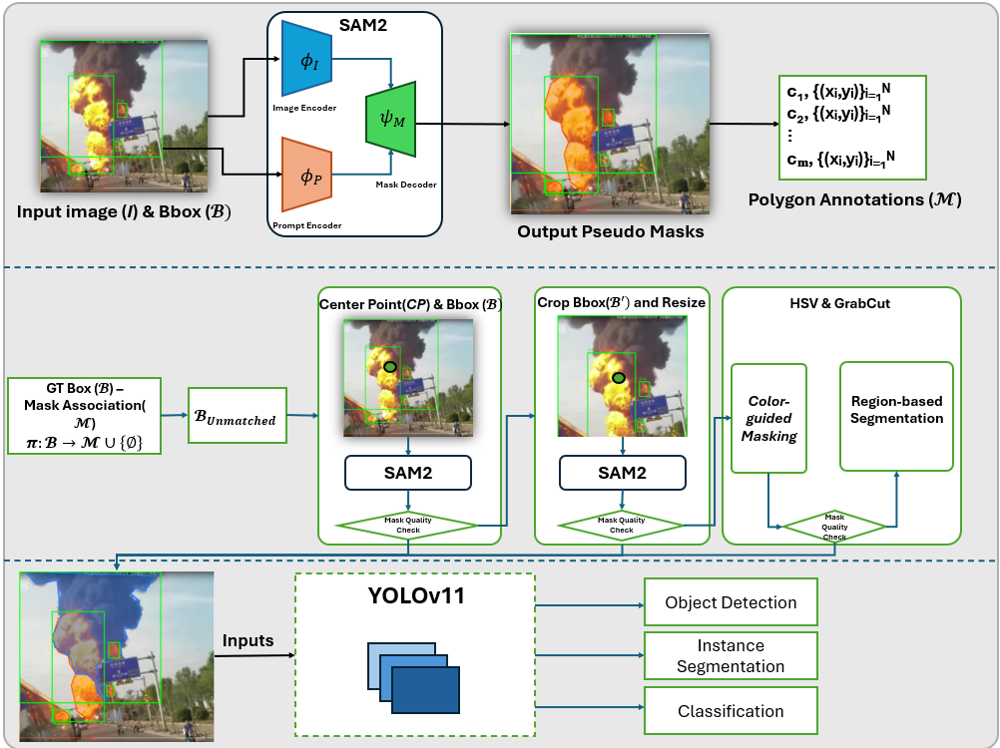
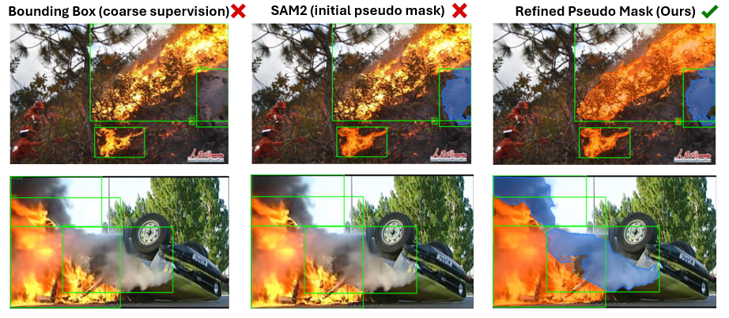

# Refining Box Annotations into High-Quality Pseudo Masks for Fire and Smoke Detection

**Cao Thanh Bang** &middot; **Lương Đức Vinh**<sup>†</sup>

VTS &mdash; Viettel &middot; <sup>†</sup>Mentor / Advisor &middot; Viettel Digital Talent (VDT) Program &middot; HCMUT

[](https://YOUR_USERNAME.github.io/YOUR_REPO)
[](https://drive.google.com/file/d/1VQazsmrkOL5lvU_W2SU7pjcOKYn7KFNp/view?usp=sharing)
[](https://huggingface.co/spaces/Bangdeptrai/fasdd-cv-demo)
[](#license)

<p align="center">
  
</p>

Bounding boxes are a poor fit for fire and smoke: both are irregular, semi-transparent, and constantly
changing shape, so a rectangular box always carries substantial background noise as supervision. This
repository implements a **SAM2-assisted pseudo-labeling framework** that turns the box-only annotations
of **FASDD_CV (95,314 images)** into high-quality, pixel-accurate pseudo masks &mdash; without any
additional manual labeling &mdash; and uses them as auxiliary supervision to train **YOLO11m / YOLO11m-Seg**
for fire and smoke detection.

🔔 The mask-refinement pipeline, training scripts, and Gradio demo in this repo are all functional.
Model checkpoints are distributed separately (see [Demo](#-demo)).

## ✈️ Overview

- **Box-prompted mask generation.** Every ground-truth box is used as a SAM2 prompt to produce an
  initial candidate mask, matched back to its source box by centroid distance rather than index order.
- **4-tier cascaded refinement.** Boxes SAM2 misses on the first pass are escalated through midpoint
  prompting, crop-and-resize for small objects, an HSV heuristic for fire, and GrabCut region growing
  for smoke &mdash; recovering reliable masks through iterative prompting instead of accepting the first result.
- **Coverage-based quality control.** Since no ground-truth mask exists to validate against, mask
  reliability is measured as the fraction of the source box recovered by each candidate, and only masks
  above a minimum coverage threshold are kept.
- **Joint detection + segmentation training.** The refined masks are used as auxiliary supervision for
  YOLO11m-Seg, improving boundary-aware localization (mAP50-95) over box-only training.
- **EDA and quality tooling.** Dedicated modules audit coverage, leakage, and failure modes of the
  generated pseudo-labels before they are used for training.

## 🧩 Repository Structure

This repository contains three sub-projects:

```
.
├── pipeline/           # Core source: SAM2 refinement + YOLO training
│   ├── configs/         # paths.yaml — dataset / output paths
│   ├── notebooks/        # Colab / Kaggle notebooks used during development
│   ├── scripts/           # CLI entry points (see below)
│   └── src/
│       ├── data/           # annotation parsing, YOLO dataset.yaml generation
│       ├── refine/          # SAM2 cascade: matching, tiers G1–G4, pipeline orchestration
│       ├── quality/          # EDA, cleaning, visualization of pseudo-mask quality
│       └── train/             # YOLO11m / YOLO11m-Seg training & evaluation
├── hf_spaces/           # Gradio app + FLAME temporal post-processing (Hugging Face Space)
├── docs/                # Static project page (GitHub Pages)
└── static/              # Figures used across docs/ and this README
```

## ⚙️ Installation

Requires Python 3.10+.

```bash
git clone https://github.com/YOUR_USERNAME/YOUR_REPO.git
cd YOUR_REPO/pipeline

conda create -n fasdd-cv python=3.10
conda activate fasdd-cv
pip install -r requirements.txt
```

The Gradio demo (`hf_spaces/`) has its own `requirements.txt` and is deployed independently on
Hugging Face Spaces — see its [README](hf_spaces/README.md).


## 📦 Checkpoints

| Checkpoint | Task | Backbone / imgsz | Download |
|---|---|---|---|
| YOLO11m (from scratch) | Detection | 640 | [link](https://drive.google.com/file/d/10U-l21FFfdlaYtF2tu4i-YRSVt6gm4Q9/view?usp=drive_link) |
| YOLO11m (fine-tuned, 50 ep) | Detection | 640 | [link](https://drive.google.com/file/d/1tnPE5La4Np-EnE_sS_iZAZiJVGBHiMW7/view?usp=drive_link) |
| YOLO11m (fine-tuned, 100 ep) | Detection | 1024 | [link](https://drive.google.com/file/d/1FREtYza2CurjAxDMwCmf1yzJhpRJG-N6/view?usp=drive_link) |
| YOLO11m-Seg (pseudo masks) | Detection + Instance Segmentation | 1024 | [link](https://drive.google.com/file/d/1Ut0tKnAzUwE34BTElfdXOTG9QWS7Jm4l/view?usp=drive_link) |
| YOLO-based semantic segmentation | Semantic Segmentation | 640 | [link](https://drive.google.com/file/d/1XIh2BTHChrVTjDJX7f-gN1UuUzbCUoyx/view?usp=drive_link) |
| SegFormer-B2 | Semantic Segmentation | 640 | [link](https://drive.google.com/file/d/1cJuSP6u6xH1Z7vuPKYiCBzr1mGGxuJ58/view?usp=drive_link) |

Download the checkpoint(s) you need and point `configs/paths.yaml` (or the `--checkpoint` /
`--weights` flag of `scripts/run_eval.py`) at the local path before running evaluation or the demo.

## 🏎️ Quick Start

All entry points live in `pipeline/scripts/` and read dataset and output locations from
`pipeline/configs/paths.yaml`. Point that file at your local copy of FASDD_CV before running anything;
each script also accepts `--help` for its full set of options.

```bash
cd pipeline

# 1. Exploratory data analysis / pseudo-mask quality audit
python scripts/run_quality_eda.py --config configs/paths.yaml

# 2. Run the SAM2-assisted cascaded refinement pipeline (Stage 1 + Stage 2)
python scripts/run_refinement.py --config configs/paths.yaml

# 3. Train YOLO11m / YOLO11m-Seg with the refined pseudo masks
python scripts/run_training.py --config configs/paths.yaml

# 4. Evaluate a trained checkpoint on the FASDD_CV test split
python scripts/run_eval.py --config configs/paths.yaml
```

## 📑 Core Modules

### `src/refine` — SAM2 cascade

| Module | Description |
|---|---|
| `pipeline.py` | Orchestrates Stage 1 (box-prompted SAM2 masks) and Stage 2 (cascaded refinement) end-to-end. |
| `matching.py` | Matches predicted masks to their source box by centroid distance and checks coverage to decide which boxes still need refinement. |
| `tiers.py` | Implements the four escalating refinement generators — box+midpoint prompting, crop-and-resize, HSV threshold (fire), and GrabCut (smoke). |
| `io_utils.py` | Reads/writes box and polygon annotations, and converts accepted masks into simplified polygons. |
| `progress.py` | Checkpointed, resumable processing so long refinement runs can pick up where they left off. |
| `config.py` | Cascade thresholds and generator parameters (coverage thresholds, HSV ranges, crop padding, etc). |

### `src/data`, `src/quality`, `src/train`

| Module | Description |
|---|---|
| `data/annotations.py` | Parses FASDD_CV box annotations and converts between box and YOLO formats. |
| `data/dataset_yaml.py` | Generates the YOLO-format `dataset.yaml` for detection / segmentation training. |
| `quality/eda.py`, `quality/visualize.py` | Exploratory analysis of pseudo-mask coverage, leakage, and failure taxonomy. |
| `quality/cleaning.py` | Removes duplicate and degenerate polygons before training. |
| `train/model.py`, `train/train.py` | YOLO11m / YOLO11m-Seg model setup and training loop. |
| `train/evaluate.py` | Test-split evaluation (AP50, mAP50-95, precision, recall). |
| `train/logging_utils.py` | Training/eval logging utilities. |

## 📊 Results

Test-set performance on FASDD_CV (15,884 images, 17,242 instances), compared against the original
FASDD baselines:

| Model | AP50 (fire) | AP50 (smoke) | mAP50 | mAP50-95 | Precision | Recall |
|---|---|---|---|---|---|---|
| ST | 81.50 | 76.10 | 78.80 | – | – | – |
| ImgPT-ST | 83.40 | 86.40 | 84.90 | – | – | – |
| YOLO11m (from scratch) | 87.64 | 85.64 | 86.64 | 61.92 | 86.71 | 77.53 |
| YOLO11m (COCO fine-tuned, 640px, 50 ep) | 88.14 | 85.80 | 86.97 | 62.88 | 86.84 | 77.65 |
| YOLO11m (COCO fine-tuned, 1024px, 100 ep) | 88.00 | 86.90 | 87.43 | 63.28 | 87.80 | 79.10 |
| **YOLO11m-Seg — with pseudo masks** | **88.50** | **85.30** | **86.90** | **68.40** | **86.60** | **78.10** |

Pseudo-mask supervision gives the largest gain in mAP50-95 (+5.1 over the best box-only model) —
tighter, boundary-aware localization rather than more detections at the loose IoU=0.5 threshold.

<p align="center">
  
  <br/><em>Bounding box vs. SAM2's first-pass mask vs. the refined pseudo mask.</em>
</p>

<p align="center">
  
  <br/><em>Qualitative predictions from YOLO11m-Seg on FASDD_CV test images.</em>
</p>

## 📽️ Demo

`hf_spaces/` contains a Gradio app that runs a trained YOLO11m-Seg checkpoint with optional FLAME
temporal post-processing on uploaded video. It is deployed at:

**https://huggingface.co/spaces/Bangdeptrai/fasdd-cv-demo**

See [`hf_spaces/README.md`](hf_spaces/README.md) for local setup and checkpoint requirements.

## 📄 Citation

If you find this work useful, please consider citing:

```bibtex
@misc{cao2026refining,
      title={Refining Box Annotations into High-Quality Pseudo Masks for Fire and Smoke Detection},
      author={Cao Thanh Bang and Luong Duc Vinh},
      note={VTS -- Viettel, Viettel Digital Talent Program Technical Report},
      year={2026}
}
```

## License

License to be determined — add a `LICENSE` file at the repository root and update this section
(and the badge above) once decided.
